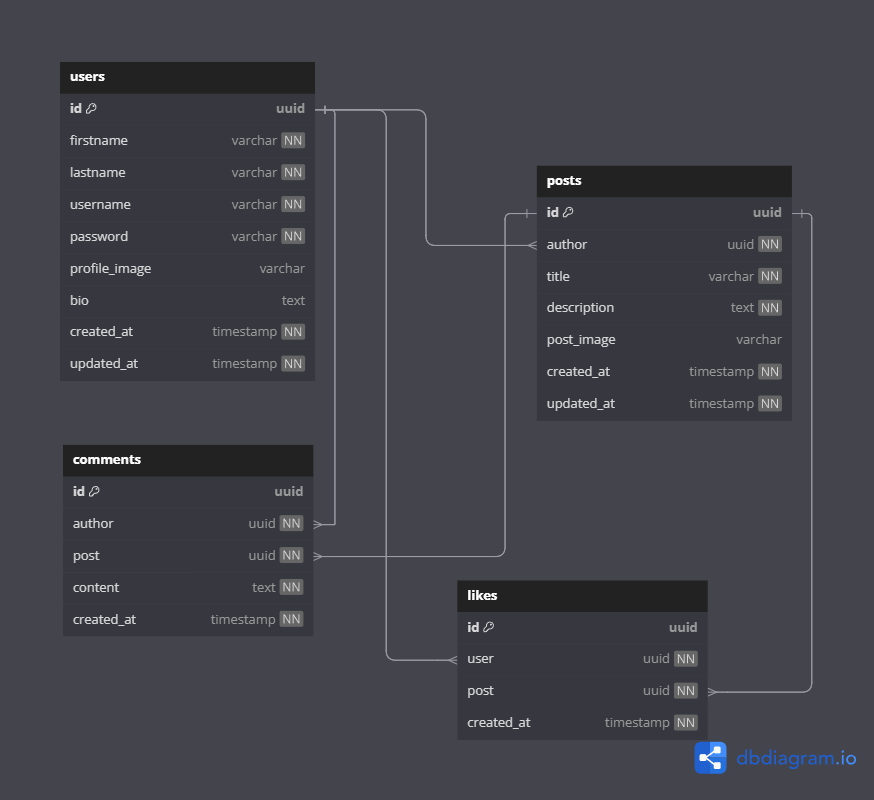

# Notify (Simple Social Media App)

Notify is a hobby project built using **Jquery**, **Express.js**, **EJS**, **Cloudinary**, **REDIS** and **MongoDB**. This app serves as a simple social media application built by **Keith Poncardas**.

## Features
- Express.js for backend handling
- EJS for templating
- Cloudinary for image upload
- MongoDB for database management
- Jquery for Ajax
- Authentication with JWT
- Basic CRUD operations
- REDIS for DB Caching and Load Optimization

## DATABASE DESIGN (ERD)


## Installation
1. **Clone the repository:**
   ```sh
   git clone https://github.com/Keith-Poncardas/notify.git
   cd notify
   ```
2. **Install dependencies:**
   ```sh
   npm install
   ```

## Environment Variables
Create a `.env` file in the root directory and add the following:

```
MONGO_URL=<YOUR MONGO URL>
PORT=<YOUR PREF PORT>
JWT_SECRET=<JWT SECRET>
JWT_EXPIRATION=<YOUR PREF JWT EXP>

# CLOUDINARY
CLOUD_NAME=<YOUR CLOUDINARY NAME>
API_KEY=<YOUR CLOUDINARY API>
API_SECRET=<YOUR CLOUDINARY API KEY>

# REDIS CLIENT
REDIS_HOST=<YOUR REDIS HOST>
REDIS_PASS=<YOUR REDIS PASS>
```

## Running the App
Start the development server:
```sh
node server.js
```

## License
This project is for personal use and learning purposes only.
